# Introduction

Initially I have to check the websites for inspiration and research. 
I have to check what the current websites are offering.
Also, I have to take a good look at their UI

So far, the following list of websites has been finalized:

- Socrative
- examai.ai
- lowtech.ai
- gradewise.ai
- examjam.com
- ai.tutor2u.net
- thinka.ai

# Socrative

- Socrative is a site where the teachers can conduct quizzes.
- They can make a Quiz and create rooms where the students may attempt quizzes
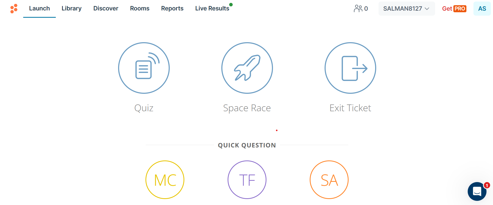
- The teacher is able to monitor the exams live where they are able to see each and every MCQ being marked by the student
- **AI FEATURE:** The teachers are able to drag and drop PDF and let the AI generate the MCQs/questions for them.
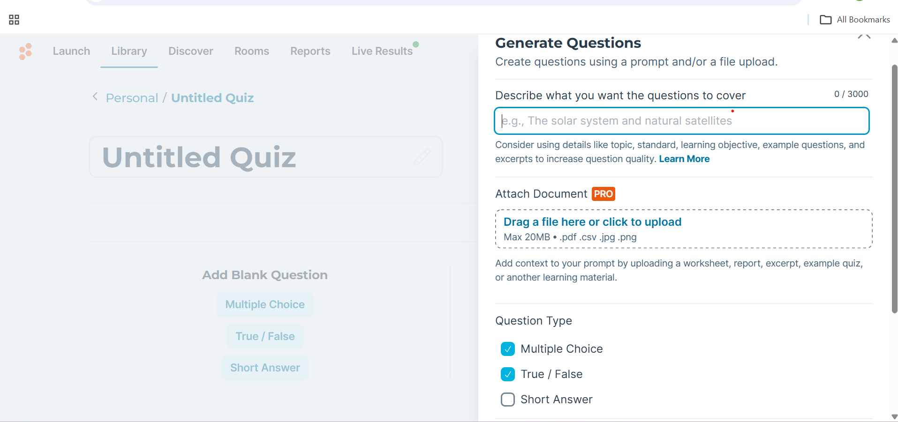

# Examai.ai

- Upon the onboarding user was asked about the subject but as far as I know, It had no effect
- The questions paper can be generated with prompt and the user may answer the set of questions in the exam.
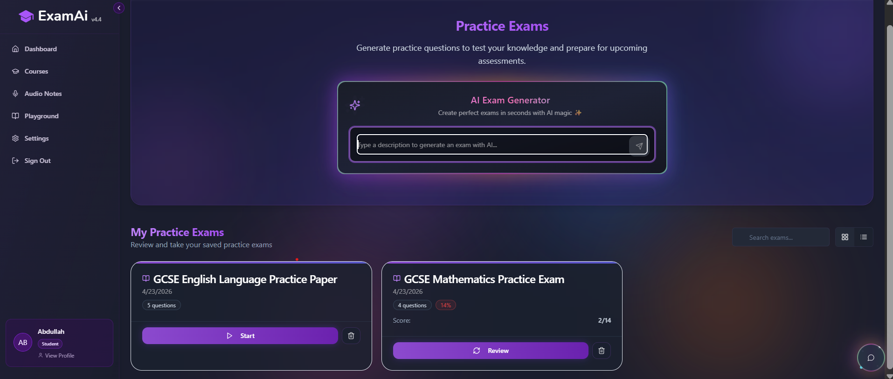

- The questions are both MCQs and Written

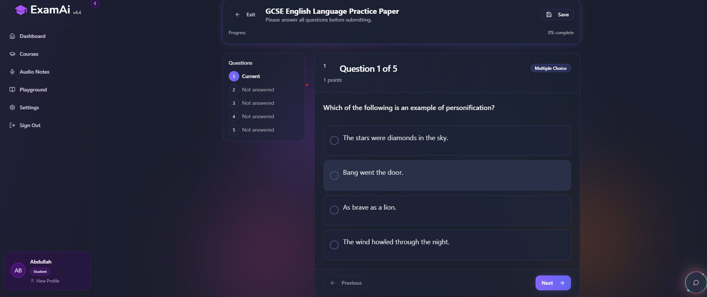

- The results arrive after a short interval

NOTES:

- The site was buggy
- The features were not completely developed
- I assume they are using very compute heavy LLM calls with huge latency which is definitely not sustainable

# Low Tech AI

- This platform has no input validation. No matter what input you give, a response will be generated
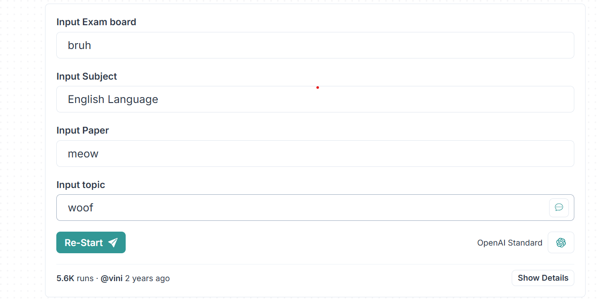

- I assume that they have fed the paper patterns of different subjects in a system prompt and then are using an LLM call to figure out the subject and display the results

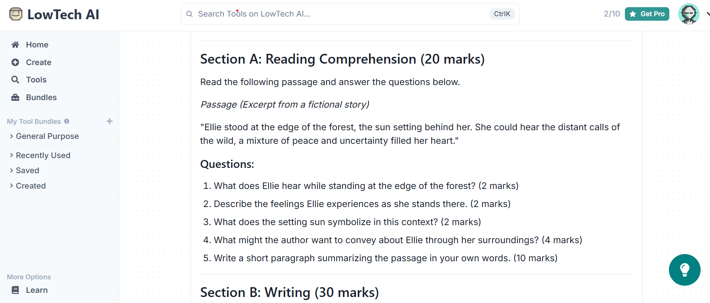

- Here is an example where I input the subject as _**'XD haha bonjour'**_ and a French paper was generated

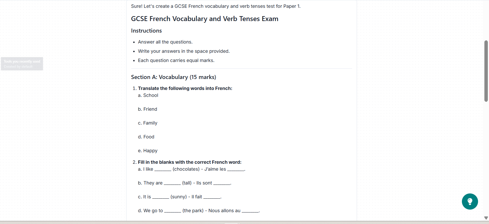

# Grade Wise

- Grade Wise had a lot of options but the English Literature was only available in Beta version with just the AQA board
- Upon trying the results were quite reliable...
- I chose the Jane Austen's Pride and Prejudice and copy pasted an AI generated essay which the system marked well and also mentioned the AO-1, AO-2 and AO-3 scores

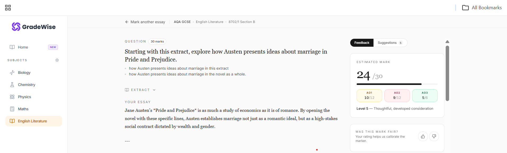

- The system also gave the reason for the score

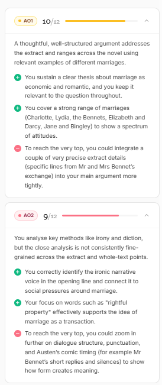

- The system also provided the feedback summary

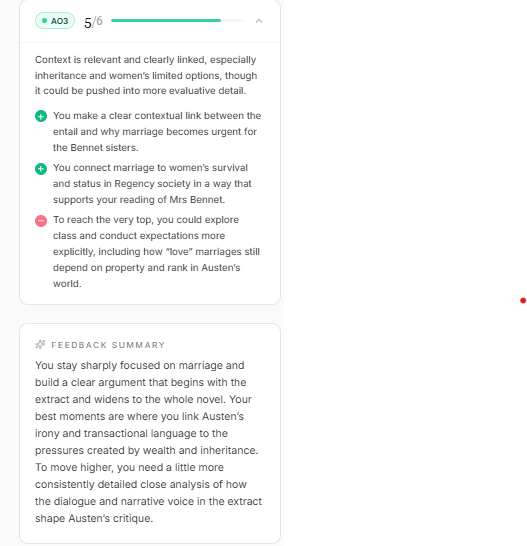

- Finally the trick or the improvement tip to proceed to the next level was also provided

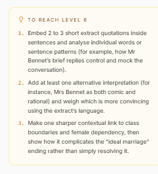

- The flashcard option was also available

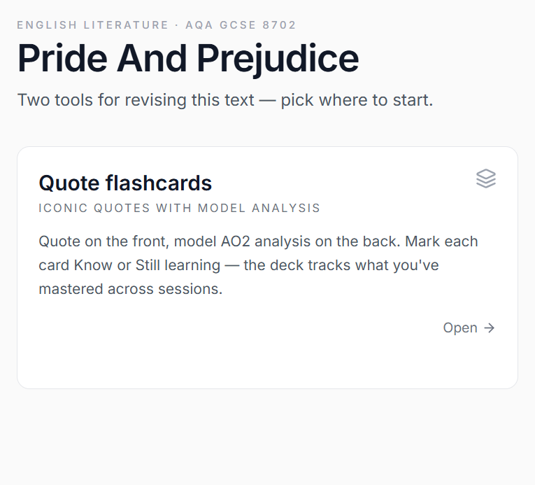

- Also, there was a wide variety of topics to choose from. And they had sections for Shakespeare, 19th century literature, Modern texts and poems.

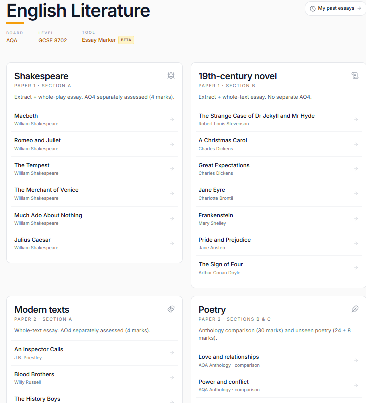

# Exam Jam

- Exam Jam has an entire section dedicated to literature and language
- There are 8 different topics to choose from

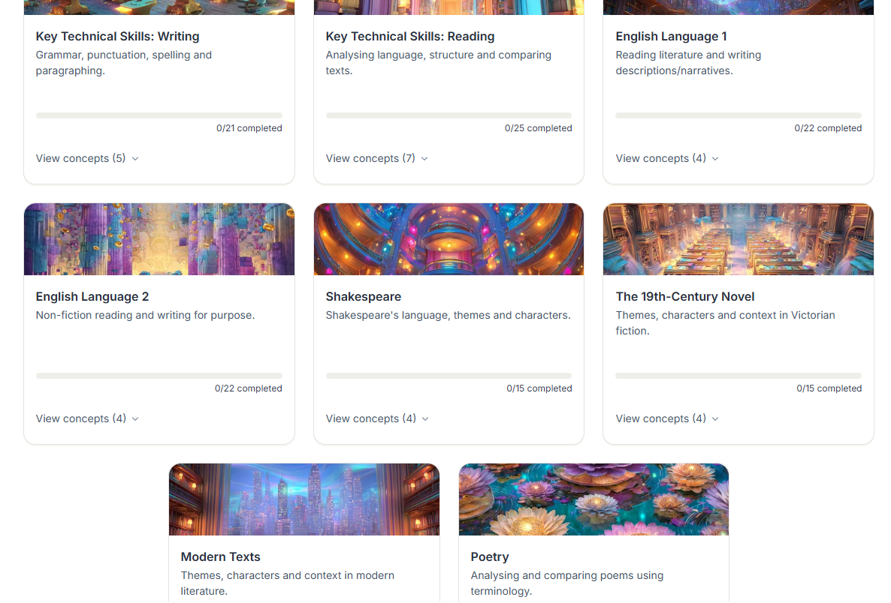

- Each topic has key concepts
- To get a better grip at those concepts, the activities are available at our disposal on the site.

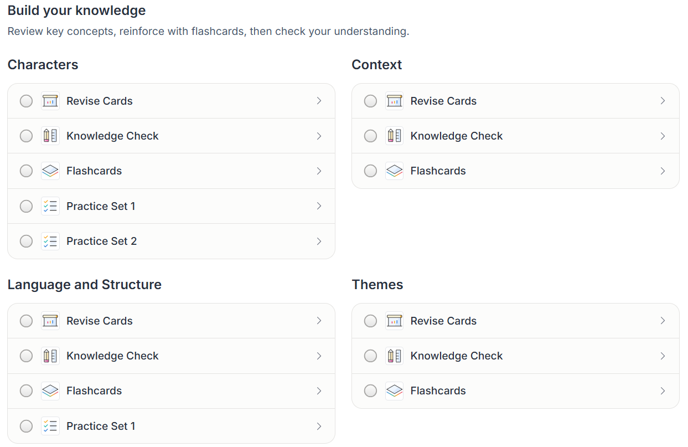

- The following is a knowledge check activity which is structured as MCQs

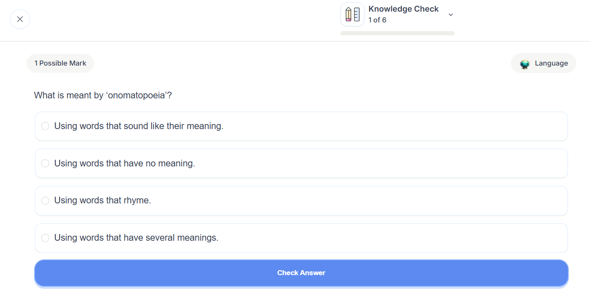

- The flash card activities were also there (_I did not understand what they were conveying_)

# Tutor 2 U

- This website was paid so I didn't proceed but there was some important marking information on their home page which I believe could be of some use.

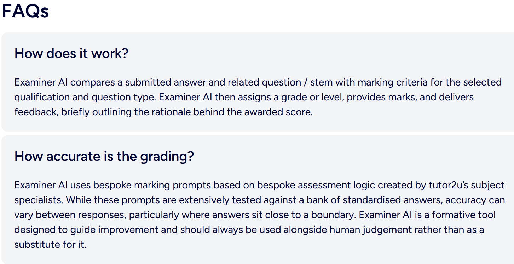

# Thinka

- This website had 6 sections available for AQA board with 21 chapters combined

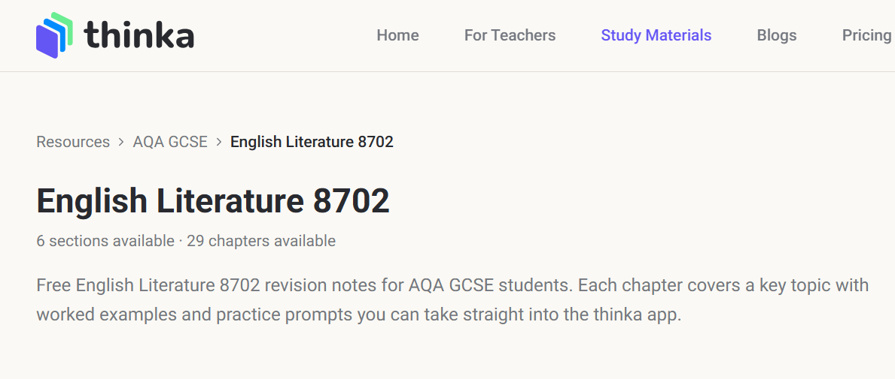

- The chapters were were related to novels or poetry themes or plays

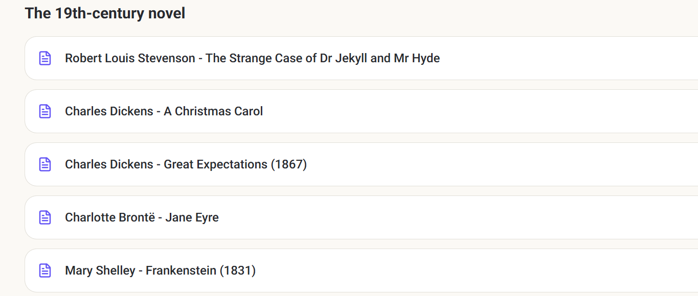

- Each chapter had content regarding themes, topics, summary and exam tips

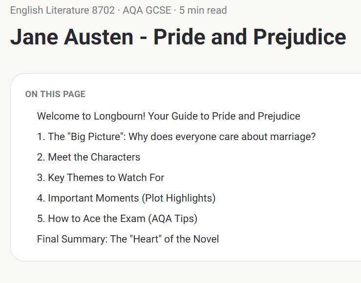

- The chapter about poems and unseen poems also had practical guide to breaking down the themes, understanding the poems and understanding the AQA paper

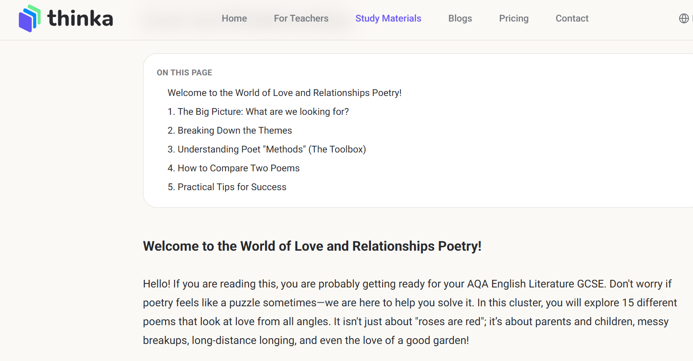

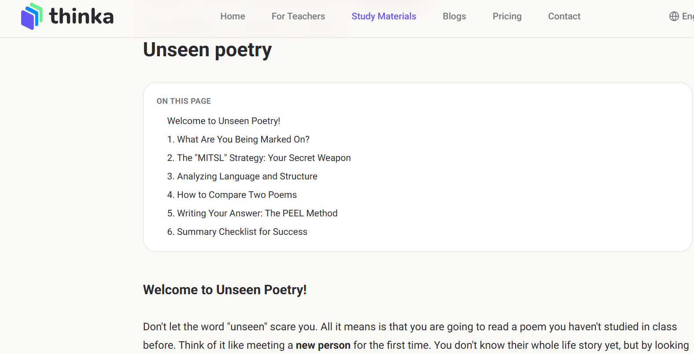

# Conclusion (_draft final_)

- Most platforms are generalized for all subjects while we are targeting English Language and Literature
- Some websites had a terrible implementation of AI
- Most websites were more of a resource prep site instead of an AI Exam Marker
- **=="Grade Wise"==** was a notable exception it marks the exams and gives feedback just as we intend
- **=="Exam Jam"==** had an implementation of flash cards (_I didn't understand the purpose of those and how they were helpful_)
- **=="Thinka"==** had good resources about how to attempt the exams

